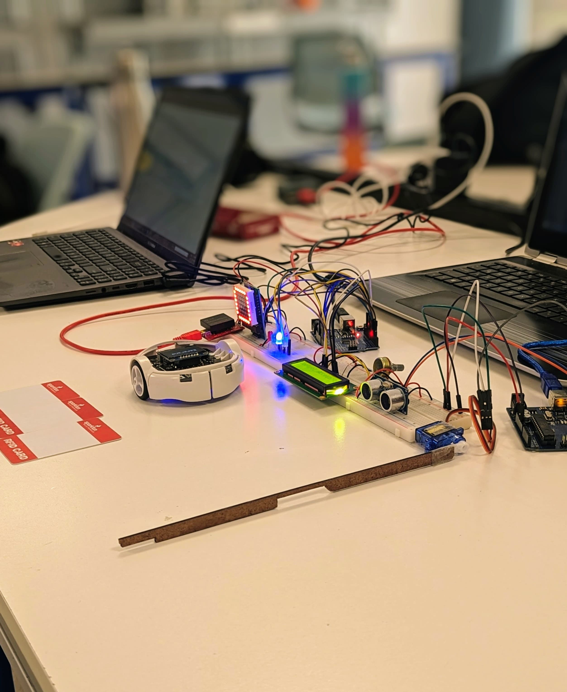

# Sistema de control de acceso / Raspberry Pi 4
Sistema de acceso mediante un lector de tarjetas RFID, teniendo control visual de los accesos y registro de usuarios mediante una interfaz web. Para poder desarrollar y controlar este proyecto, se utilizó una Raspberry Pi 4 debido a su bajo costo y tamaño compacto en comparación a otras computadoras. Consideramos que este proyecto es beneficioso para la comunidad, pues permite tener una mejor seguridad así como un control preciso de las personas que intentan acceder, así como aquellas que acceden y salen y a qué hora sucede esto. Tener esta información puede ser útil para garantizar la seguridad de un lugar.

## Video demostrativo del proyecto:  
  

## Diagrama de funcionamiento

  

## Imágen de prototipo final

  

